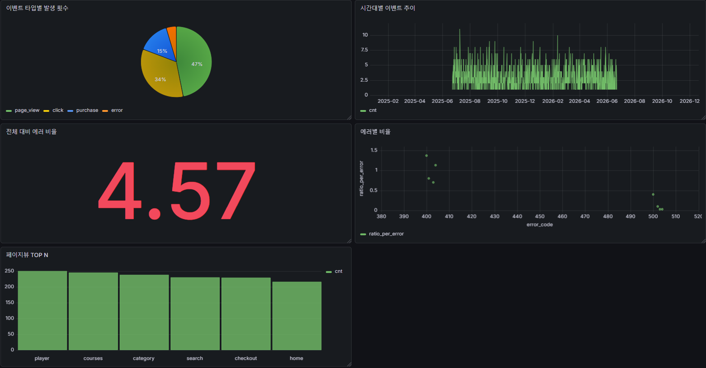

# 이벤트 로그 파이프라인

웹 서비스의 유저 행동 이벤트를 **생성 → 적재 → 변환 → 집계 → 시각화**하는 데이터 파이프라인

## 목차

1. [개요 및 아키텍처](#1-개요-및-아키텍처)
2. [기술 스택](#2-기술-스택)
3. [실행 방법](#3-실행-방법)
4. [데이터 모델 / 스키마 설계 이유](#4-데이터-모델--스키마-설계-이유)
5. [분석 쿼리](#5-분석-쿼리)
6. [시각화 (Grafana)](#6-시각화-grafana)
7. [구현하며 고민한 점](#7-구현하며-고민한-점)
8. [선택 과제](#8-선택-과제)

---

## 1. 개요 및 아키텍처

- 원본을 먼저 보존한 뒤 정규화하는 **ELT 기반 파이프라인**
- 생성기가 만든 이벤트를 `raw_events`에 원본 그대로 적재(Load)한 뒤, 검증·정규화(Transform)해 분석용 테이블로 옮깁니다.

```
[이벤트 생성기]              가짜 이벤트 생성 (Faker)
      │  Load (배치 INSERT)
      ▼
[raw_events]                원본 JSONB 보존
      │  Transform (검증·정규화, 멱등)
      ▼
[events + 상세 이벤트]
      │  집계 SQL
      ▼
[Grafana] 시각화
```

---

## 2. 기술 스택

| 구분      | 사용 기술                     |
| --------- | ----------------------------- |
| 언어      | Python 3.12 (Faker, psycopg2) |
| 저장소    | PostgreSQL 16                 |
| 실행 환경 | Docker / Docker Compose       |
| 시각화    | Grafana                       |

---

## 3. 실행 방법

### 3.1 docker-compose 실행

```bash
# 1. 환경변수 파일 준비 (.env는 git에 포함되지 않음 / 더미 값이라 수정 없이 바로 실행 가능)
cp .env.example .env

# 2. 전체 스택 한 번에 실행 (DB + 파이프라인 앱 + Grafana)
docker compose up -d --build
```

### 3.2 생성 데이터 개수 조정 (선택)

기본 **10,000개**를 생성합니다. 개수를 바꾸려면 `SIZE` 환경변수를 지정합니다.

```bash
# 방법 1: 실행 시 지정
SIZE=50000 docker compose up -d --build

# 방법 2: .env에 한 줄 추가 후 실행 (OS 무관)
#   SIZE=50000
```

### 3.3 시각화 확인

- **Grafana 대시보드**: http://localhost:3000 (별도 로그인 불필요)

---

## 4. 데이터 모델 / 스키마 설계 이유

### 4.1 PostgreSQL 선택 이유

- 이벤트를 필드 단위로 구분하여 저장하고 무결성을 강제하며 집계 분석을 위해 관계형 DB를 선택하였습니다.
- 그중 PostgreSQL은 원본 이벤트를 JSON 형태 그대로 보존하는 데 사용한 JSONB 타입을 지원하여, 원본 보존과 정규화 분석을 한 DB에서 처리할 수 있어 선택했습니다.

### 4.2 테이블 구성

| 테이블                         | 역할                    |
| ------------------------------ | ----------------------- |
| `raw_events`                   | 원본 이벤트 보존        |
| `events`                       | 모든 이벤트 공통 속성   |
| `purchase` / `error` / `click` | 이벤트 타입별 고유 속성 |

### 4.3 설계 이유

- 이벤트별로 응답받는 필드가 달라 이를 구분할 필요가 있었습니다.
- 조회 시 JOIN 비용과 쓰기 시 트랜잭션 복잡도를 감수하더라도, 타입별 필드 무결성(NOT NULL 등)을 강제하고 NULL을 없애기 위해 공통/타입별 테이블로 분리했습니다.

### 4.4 테이블별 컬럼

#### raw_events

| 컬럼           | 타입        | Null   | 설명                          |
| -------------- | ----------- | ------ | ----------------------------- |
| `event_id`     | UUID        | N (PK) | 이벤트 ID                     |
| `payload`      | JSONB       | N      | 이벤트 원본                   |
| `processed_at` | TIMESTAMPTZ | Y      | 이벤트 적재 시각(NULL=미처리) |

#### events

| 컬럼         | 타입         | Null   | 설명                           |
| ------------ | ------------ | ------ | ------------------------------ |
| `event_id`   | UUID         | N (PK) | 이벤트 ID                      |
| `event_type` | ENUM         | N      | page_view/purchase/error/click |
| `user_id`    | INTEGER      | N      | 유저 ID                        |
| `event_time` | TIMESTAMPTZ  | N      | 이벤트 발생 시각(UTC)          |
| `page_name`  | VARCHAR(100) | N      | 발생 페이지                    |
| `device`     | VARCHAR(50)  | N      | 발생 기기                      |

#### purchase

| 컬럼               | 타입         | Null      | 설명               |
| ------------------ | ------------ | --------- | ------------------ |
| `event_id`         | UUID         | N (PK/FK) |                    |
| `price`            | BIGINT       | N         | 결제 금액(원 단위) |
| `payment_method`   | ENUM         | N         | 카드/페이/계좌이체 |
| `product_id`       | BIGINT       | N         | 상품 ID            |
| `product_name`     | VARCHAR(255) | N         | 상품 이름          |
| `product_category` | VARCHAR(100) | N         | 상품 카테고리      |

#### error

| 컬럼          | 타입         | Null      | 설명                                    |
| ------------- | ------------ | --------- | --------------------------------------- |
| `event_id`    | UUID         | N (PK/FK) |                                         |
| `error_level` | ENUM         | N         | WARNING/ERROR/CRITICAL (정의순=심각도↑) |
| `error_code`  | INTEGER      | N         | HTTP 상태코드(4xx=클라이언트/5xx=서버)  |
| `error_msg`   | VARCHAR(100) | N         | 표준 reason phrase                      |

#### click

| 컬럼               | 타입         | Null      | 설명                      |
| ------------------ | ------------ | --------- | ------------------------- |
| `event_id`         | UUID         | N (PK/FK) |                           |
| `element_type`     | VARCHAR(100) | N         | 태그 타입(a/button/input) |
| `click_event_name` | VARCHAR(100) | N         | 클릭 행동 의미            |

---

## 5. 분석 쿼리

집계 쿼리는 Grafana 패널로 활용됩니다. (쿼리 원본: `db/aggregate.sql` 또는 대시보드 JSON)

| #   | 분석                      | 종류         |
| --- | ------------------------- | ------------ |
| 1   | 이벤트 타입별 발생 횟수   | GROUP BY     |
| 2   | 일별 × 타입별 이벤트 추이 | 시계열       |
| 3   | 전체 대비 에러율          | 비율         |
| 4   | 에러 코드별 비율          | 비율         |
| 5   | 페이지뷰 TOP N            | 정렬 + LIMIT |

---

## 6. 시각화 (Grafana)

- **대시보드 스크린샷 첨부**
  

- Postgres 데이터소스 + 대시보드를 **프로비저닝**으로 자동 구성 (`grafana/provisioning/`)
- `docker compose up`만으로 데이터소스 연결 + 대시보드가 자동 로드됩니다.

---

## 7. 구현하며 고민한 점

### 7.1 ELT 파이프라인 구조

- 로그 데이터는 원본이 훼손되지 않는 것이 중요하다고 생각하여, 원본을 먼저 보존한 뒤 정규화하는 구조로 설계했습니다.
- 생성기가 만든 이벤트를 `raw_events`에 원본 그대로 적재한 뒤, 검증·정규화해 분석용 테이블로 옮깁니다.
- 또한 변환 로직이 바뀌거나 버그가 생겨도 원본이 남아 있어 다시 변환할 수 있습니다.

### 7.2 멱등성

- 중복 데이터가 들어오거나 INSERT가 실패해도 안전하게 재처리되도록 설계했습니다.
- INSERT와 `processed_at` 갱신을 **하나의 트랜잭션**으로 묶어, 중간에 실패하면 롤백되어 `processed_at`이 NULL로 남으므로 안전하게 재처리됩니다.
- 재처리 시에도 `WHERE processed_at IS NULL`로 미처리 건만 고르고, `ON CONFLICT DO NOTHING`으로 중복 적재를 막아 여러 번 실행해도 결과가 동일합니다.

### 7.3 Batch INSERT

- 현재 기본 생성 개수는 1,000개이지만, 추후 대용량 데이터를 고려하여 batch 단위로 insert되도록 했습니다.
- 한 건씩 INSERT하면 DB 왕복이 많아 느려지므로, 여러 행을 한 번의 쿼리로 묶어 보내는 `execute_values`를 사용해 왕복을 줄였습니다.

---

## 8. 선택 과제

### A. Kubernetes manifest

### B. AWS 아키텍처
